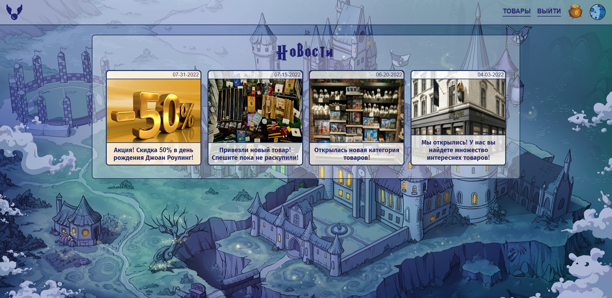
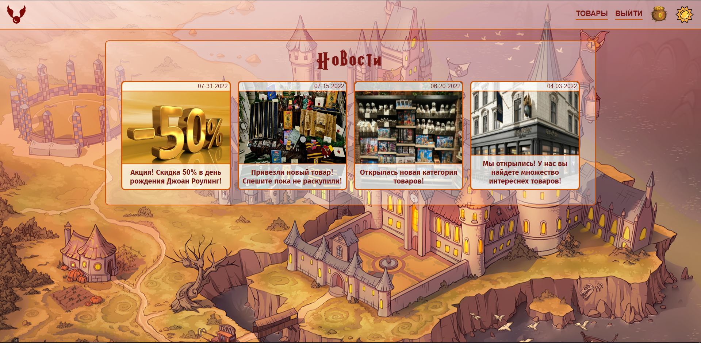
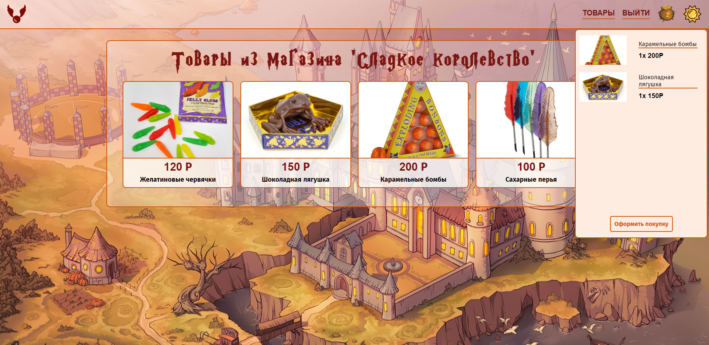
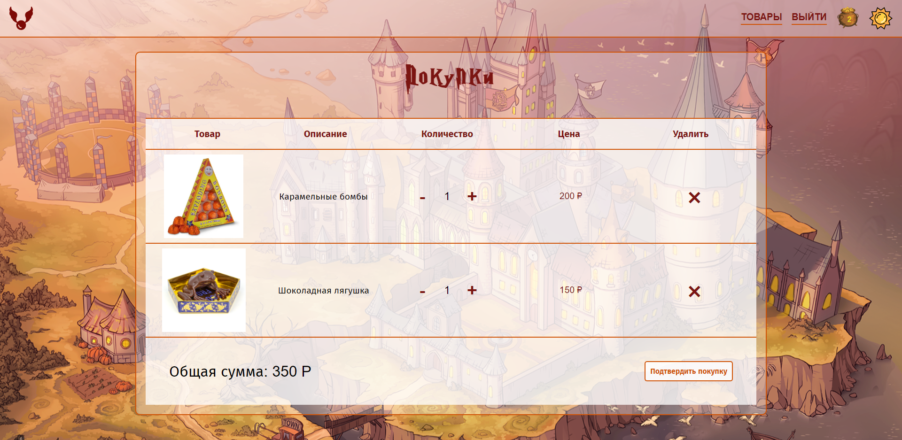
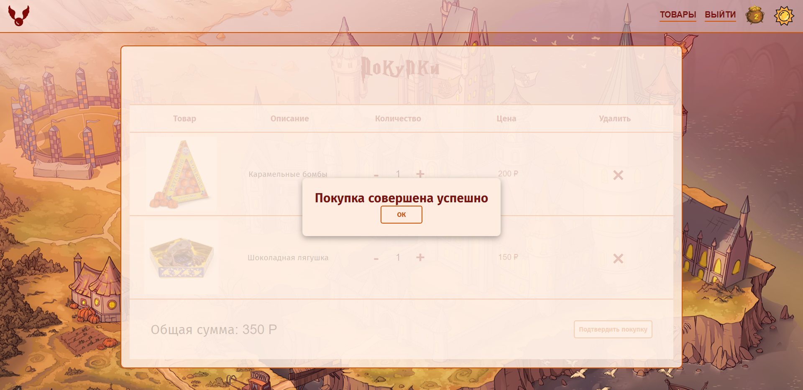
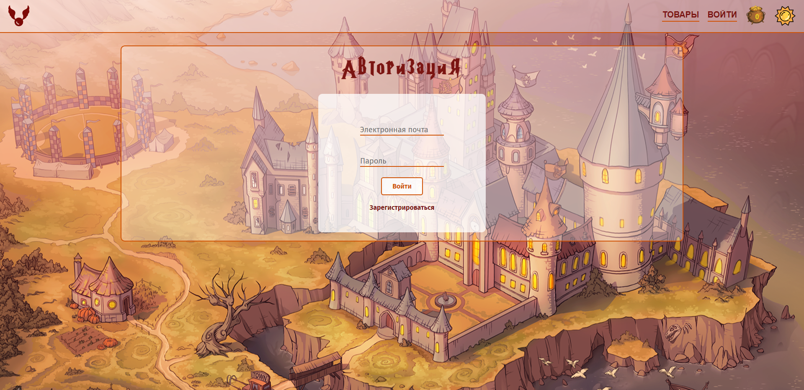
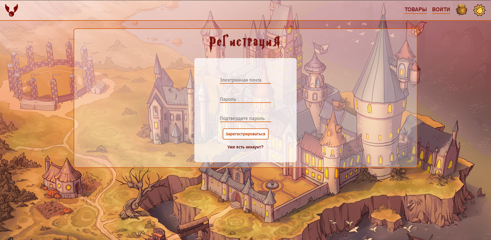

# Интернет магазин Harry Potter Store
Данное приложение является учебным проектом и было разработано с целью изучить такие библиотеки как: React, React Router, Redux, а также препроцессор Sass.
В данном приложении использовались функциональные React компоненты.
Работа с Redux хранилищем выполнялось с помощью дополнительной библиотеки Redux ToolKit. Запросы на сервера отправлялись с помощью RTK Query.

Было создано две темы приложения: темная и светлая.

Реализовано добавление товаров в корзину и работа с корзиной.

Также была реализована авторизация пользователя. В качестве сервера использовалось готовое решение:
[NestJS Boilerplate](https://nestjs-boilerplate-test.herokuapp.com/docs/#/)

